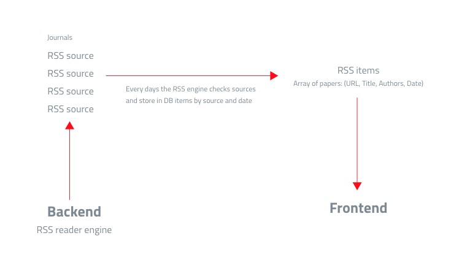

# ThePhilosophyPaperboy 2.0 Docs
Documentations about ThePhilosophyPaperboy 2.0 project.

## Introduction
ThePhilosophyPaperboy MVP version, is actually up and running [here](https://thephilosophypaperboy.com/), this is only an hacked WordPress that do the job. Data are messy and not scalable. But the service exist and it's appreciated by its users. So we want to make thinghs in the right way, any help will be appreciated.

## Backend 

The backend we want to build is basically a RSS engine who collect data from RSS source. i.e.:

This can be an Admin panel example of RSS source

| Source Name       | State | Updates | Items imported | Actions |
|:-----------|:-:|:--|:-:|:-:|
| *Etudes Platoniciennes* | working/paused | **Next update:** 55 mins, **Last updated:** 3 mins ago, **Last imported:** 0 items | 120 | stop/play/edit/remove |
| *Ancient Philosophy Today* |  working/paused | **Next update:** 55 mins, **Last updated:** 3 mins ago, **Last imported:** 20 items | 34 | stop/play/edit/remove |

And this can be an Admin panel example of RSS items

| Item Name       | Permalink | Date | Authors | Source | Actions |
|:-----------|:-:|:--|:-:|:-:|:-:|
| *Acids and Rust: A New Perspective on the Chemical Revolution* | http://... | 2021-02-23 03:29:38 | David, A., Ariyo, K. |  *Ancient Philosophy Today* | edit/hide/remove |
| *Beyond Causal Explanation: Einstein’s Principle Not Reichenbach’s* |  http://... | 2021-02-23 03:29:38  | Gupta, R., Morain, S. R. |  *Ancient Philosophy Today* | edit/hide/remove |

## Frontend

Check for wireframe of the new frontend [here](https://github.com/lc-d/paperboy-docs/tree/main/prototype/wireframes)
